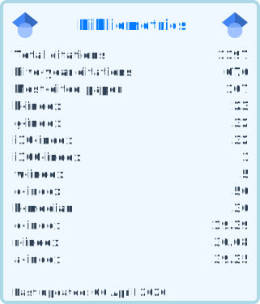

## Andre Belem

### Hi there 👋

I am an Oceanographer, from the time when the hero was (is) [Jacques Cousteau](https://en.wikipedia.org/wiki/Jacques_Cousteau). My graduation focused on Geological Oceanography (B.Sc.) and Biological Oceanography (M.Sc.), both obtained at the [Federal University of Rio Grande](https://www.furg.br/en/), RS Brazil in the period 1988-1993 and 1994-1997, respectively. I had the opportunity to delve deep into Polar Oceanography... (mantenha o restante do seu texto original aqui).

I’m (and always) learning Python... (mantenha o seu texto original sobre Python e Machine Learning aqui).

### ✍️ Editorial Board
I am an **Associate Editor** for [Frontiers in Climate](https://loop.frontiersin.org/people/1264301/overview), specifically in the section of *Predictions and Projections*.

- 💬 Ask me about my hobbies: cooking (I'm vegetarian), taking care of plants...
- ⚡ Fun fact: in 2024 I completed 30 years of Antarctic research!

## ⭐ My Academic Stats

  

📫 **How to reach me**: pretty simples - my email is [andrebelem@id.uff.br](mailto:andrebelem@id.uff.br) and you can track me on [Linkedin](https://www.linkedin.com/in/andre-l-belem/) and [ResearchGate](https://www.researchgate.net/profile/Andre-Belem). If you want to meet me "in person", you can take a look at my [current timetable](./UFF_timetable.md) at UFF.

Let's talk ?