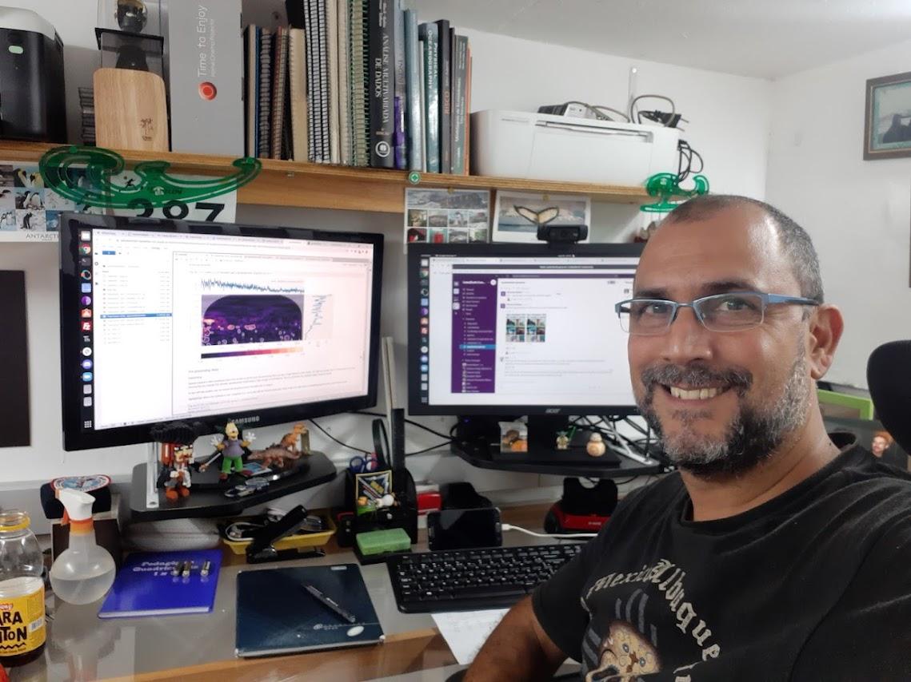

# Horários de Atendimento Acadêmico

### </img> Prof. [André L. Belém](https://www.github.com/andrebelem) (*Dr.rer.nat.*)  

E-mail: [andrebelem@id.uff.br](mailto:andrebelem@id.uff.br) 
[Departamento de Engenharia Agrícola e Meio Ambiente](http://www.ter.sites.uff.br) 
Escola de Engenharia 
Sala E-300 (Sala de Permanência e Oficina de Microeletrônica) 
Sala E-345 (Laboratório do H2O & LabCost) 

### Semestre 2024-2
| Horário          | Segunda-feira   | Terça-feira | Quarta-feira | Quinta-feira | Sexta-feira |
|------------------|-----------------|-------------|--------------|--------------|-------------|
| Manhã   | das 09 as 12 hs **Implementação de Projetos Extensionistas II** Turma Z7  *Criação de Elementos Educacionais com Impressão 3D* **Local: Lab. H2O Sala E-345/E-300** | Sala 300 Bloco E | das 09 as 13 hs **Implementação de Projetos Extensionistas III** Turma Z8  *Técnicas de Recuperação de Áreas Degradadas para Horticultura Urbana Comunitária* **Local: Estufa do TER (atrás do RU)** | das 08 as 12 hs **Mudanças Climáticas, Mitigação, Adaptação e Segurança Alimentar** Turma H1 **Local: Lab. O2 sala 300 Bloco E** | das 08 as 12 hs **Responsabilidade Social e Ambiental** Turma H1 **Local: Bloco H sala 201** |
| Tarde   | Sala 300 Bloco E   | das 16 as 18 hs **Modelagem e Otimização de Sistemas Agrícolas e Ambientais I** Turma A1  **Local: Lab. de Informática do TER Sala 235A Bloco D**  |   Sala 300 Bloco E | Sala 300 Bloco E  | Sala 300 Bloco E  |
