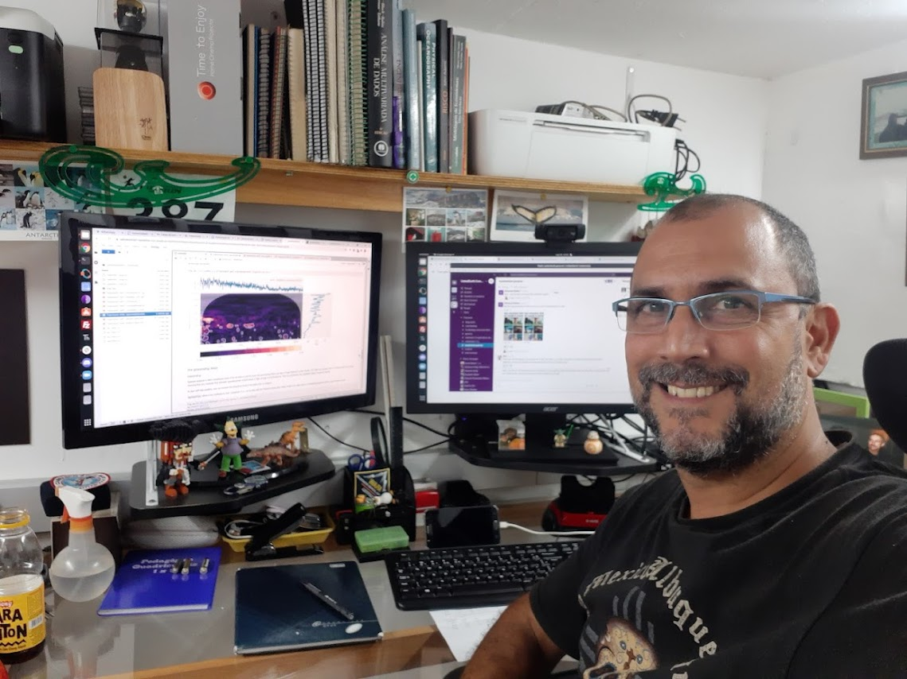

# Horários de Atendimento Acadêmico

### </img> Prof. [André L. Belém](https://www.github.com/andrebelem) (*Dr.rer.nat.*)  

E-mail: [andrebelem@id.uff.br](mailto:andrebelem@id.uff.br)  
[Departamento de Engenharia Agrícola e Meio Ambiente](http://www.ter.sites.uff.br)  
Escola de Engenharia  
Sala E-300 (Sala de Permanência e Oficina de Microeletrônica)  
Sala E-345 (Laboratório do H2O & LabCost)  

> ⚠️ **Atendimentos extra-classe devem ser previamente agendados por e-mail.**  

---

## 📅 Semestre Atual — **2026-1**

| Horário | Segunda-feira | Terça-feira | Quarta-feira | Quinta-feira | Sexta-feira |
|---|---|---|---|---|---|
| **Manhã** | a partir das 10 hs Sala 300 Bloco E | a partir das 10 hs Sala 300 Bloco E | a partir das 10 hs Sala 300 Bloco E | a partir das 10 hs Sala 300 Bloco E | a partir das 10 hs Sala 300 Bloco E |
| **Tarde / Noite** | **15:00–18:00** **TER00169 – Implementação de Projetos Extensionistas II** *Técnicas de Recuperação de Áreas Degradadas para Horticultura Urbana Comunitária* **Turma:** Z7 **Local:** LUMAS (atrás da BEE) | **16:00–20:00** **TER00167 – Mudanças Climáticas, Mitigação, Adaptação e Segurança Alimentar** **Turma:** H1 **Local:** LIGA – Sala 235A (Bloco D) | **15:00–18:00** **TER00169 – Implementação de Projetos Extensionistas II** *Criação de Elementos Educacionais com Impressão 3D* **Turma:** Z9 **Local:** O2 – Sala 345 (Bloco E) | Lab. O2 / Sala 300 Bloco E | Lab. O2 / Sala 300 Bloco E |

---

## 📚 Semestres Anteriores

### Semestre 2025-2

| Horário          | Segunda-feira   | Terça-feira | Quarta-feira | Quinta-feira | Sexta-feira |
|------------------|-----------------|-------------|--------------|--------------|-------------|
| **Manhã**        | a partir das 10 hs Sala 300 Bloco E |  a partir das 10 hs Sala 300 Bloco E |  a partir das 10 hs Sala 300 Bloco E  |  a partir das 10 hs Sala 300 Bloco E  |  a partir das 10 hs Sala 300 Bloco E  | 
| **Tarde**  **Noite** (até 20 hs) | 16:00–20:00 **Mudanças Climáticas, Mitigação, Adaptação e Segurança Alimentar - Turma H1** **Local:** LIGA Sala 235A Bloco D | 15:00–18:00 **Implementação de Projetos Extensionistas II - Turma Z7** *Técnicas de Recuperação de Áreas Degradadas para Horticultura Urbana Comunitária* **Local:** LUMAS (Atrás da BEE) | 18:00–20:00 **Modelagem e Otimização de Sistemas Agrícolas e Ambientais - Turma H1** **Local:** LIGA Sala 235A Bloco D | Lab. O2 / Sala 300 Bloco E | Lab. O2 / Sala 300 Bloco E |

### Semestre 2025-1

| Horário          | Segunda-feira   | Terça-feira | Quarta-feira | Quinta-feira | Sexta-feira |
|------------------|-----------------|-------------|--------------|--------------|-------------|
| **Manhã**        | 09:00–12:00 **Implementação de Projetos Extensionistas III - Turma Z8** *Criação de Elementos Educacionais com Impressão 3D* **Local:** Lab. H2O Sala E-345/E-300 | Sala 300 Bloco E | Sala 300 Bloco E | Lab. O2 / Sala 300 Bloco E | Lab. O2 / Sala 300 Bloco E |
| **Tarde**        | 14:00–16:00 **Mudanças Climáticas, Mitigação, Adaptação e Segurança Alimentar - Turma H1** **Local:** Lab. de Informática do TER Sala 235A Bloco D  16:00–18:00 **Sistemas de Informações Geográficas com o Google Earth Engine - Turma H1** **Local:** Lab. de Informática do TER Sala 235A Bloco D | 16:00–18:00 **Mudanças Climáticas, Mitigação, Adaptação e Segurança Alimentar - Turma H1** **Local:** Lab. de Informática do TER Sala 235A Bloco D | 16:00–18:00 **Sistemas de Informações Geográficas com o Google Earth Engine - Turma H1** **Local:** LICAD Bloco E Sala 310 | 15:00–18:00 **Implementação de Projetos Extensionistas II - Turma Z7** *Técnicas de Recuperação de Áreas Degradadas para Horticultura Urbana Comunitária* **Local:** LUMAS (Atrás da BEE) | Lab. O2 / Sala 300 Bloco E |

---

### Semestre 2024-2

| Horário          | Segunda-feira   | Terça-feira | Quarta-feira | Quinta-feira | Sexta-feira |
|------------------|-----------------|-------------|--------------|--------------|-------------|
| **Manhã**        | 09:00–12:00 **Implementação de Projetos Extensionistas II - Turma Z7** *Criação de Elementos Educacionais com Impressão 3D* **Local:** Lab. H2O Sala E-345/E-300 | Sala 300 Bloco E | 09:00–13:00 **Implementação de Projetos Extensionistas III - Turma Z8** *Técnicas de Recuperação de Áreas Degradadas para Horticultura Urbana Comunitária* **Local:** Estufa do TER (atrás do RU) | 14:00–16:00 (até 18:00) **Mudanças Climáticas, Mitigação, Adaptação e Segurança Alimentar - Turma H1** **Local:** Lab. O2 / Sala 300 Bloco E | 08:00–12:00 **Responsabilidade Social e Ambiental - Turma H1** **Local:** Bloco H Sala 201 |
| **Tarde**        | Sala 300 Bloco E | 16:00–18:00 **Modelagem e Otimização de Sistemas Agrícolas e Ambientais I - Turma A1** **Local:** Lab. de Informática do TER Sala 235A Bloco D | Sala 300 Bloco E | Sala 300 Bloco E | Sala 300 Bloco E |

---
